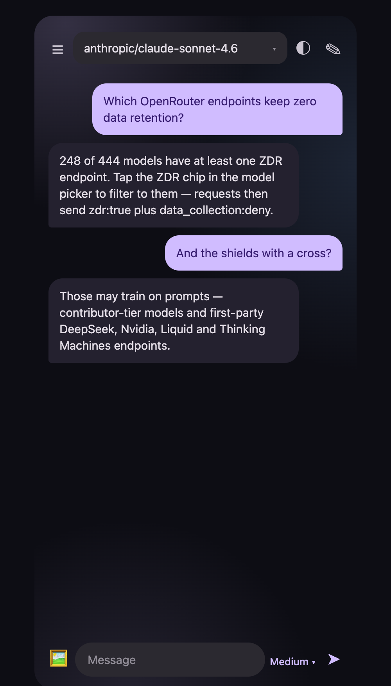

# OpenCode Chat — Android

Android chat client for [OpenCode Zen](https://opencode.ai/docs/zen), [OpenCode Go](https://opencode.ai/docs/go), and [OpenRouter](https://openrouter.ai), with data-privacy shields in the model picker.



## Features

- Chat with any model on OpenCode Zen, OpenCode Go, or OpenRouter (OpenAI-compatible + Anthropic + Gemini wire protocols with automatic fallback)
- Model picker with **privacy shields**: shield + check means a Zero Data Retention endpoint is available, shield + cross means the model may train on prompts. ZDR and FREE filter chips included
- ZDR-only mode sends `provider: {zdr: true, data_collection: "deny"}` on OpenRouter requests
- Per-provider API keys encrypted in the device keystore (StrongBox/TEE via AES-GCM)
- Reasoning-effort picker (models.dev catalog), favorites/pinning, ephemeral chats, photo attachments, per-session history

## Requirements

- JDK 17
- Android SDK with API 35 (`compileSdk`/`targetSdk` 35, `minSdk` 34 — Android 14+)
- An API key for at least one provider (Zen, Go, or OpenRouter)

## Build

```sh
git clone https://github.com/FernandoMiguel/opencode-chat-android.git
cd opencode-chat-android
./gradlew :app:assembleDebug
```

The APK lands at `app/build/outputs/apk/debug/app-debug.apk`.

## Install

- **From releases:** download the APK from the [latest release](https://github.com/FernandoMiguel/opencode-chat-android/releases), open it on the phone, allow "Install unknown apps" for the browser when prompted, and install. Builds are debug-signed previews, not Play releases.
- **Via adb** (USB debugging on, computer authorized):
  ```sh
  adb install app/build/outputs/apk/debug/app-debug.apk
  ```

Then open the app → Settings → pick a provider → save its API key.

## Privacy-shield sources

- OpenRouter ZDR endpoints: `GET https://openrouter.ai/api/v1/endpoints/zdr`
- OpenRouter training/retention policy: `GET https://openrouter.ai/api/frontend/v1/all-providers`
- Zen exceptions: https://opencode.ai/docs/zen#privacy · Go table: https://opencode.ai/docs/go#privacy
- Badges are fail-closed: unknown free-tier models show no badge rather than a shield. See `privacyFor*` in `app/src/main/java/net/lichias/opencodechat/data/ApiClient.kt`.
